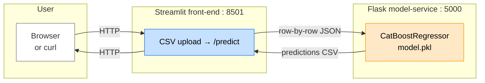
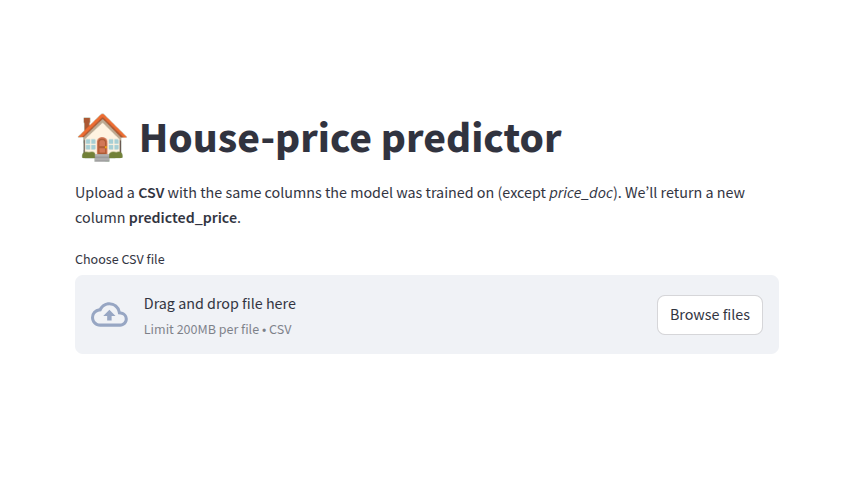
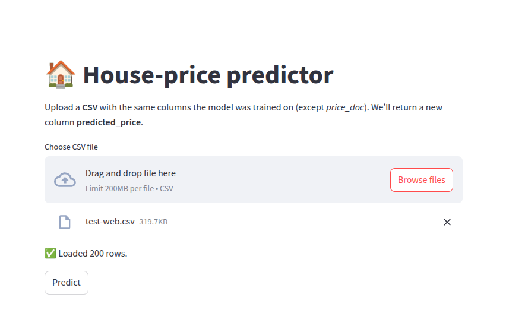
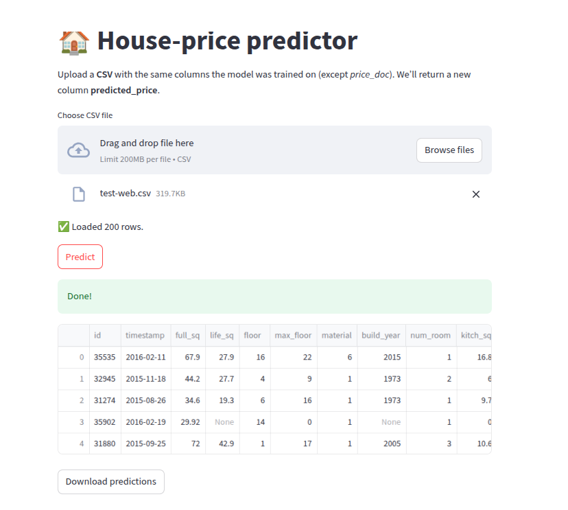

# House Price Prediction

This repository contains a **CatBoost‑based regression model** that estimates residential property sale prices for the Sberbank Russian Housing Market dataset.
The goal is to ship a **production‑ready price‑prediction service** that any analyst or stakeholder can run locally with one command and obtain price forecasts for an uploaded CSV.

The project demonstrates the full mini‑MLOps life‑cycle:

* **Training pipeline** – data cleaning, feature engineering, CatBoost training, evaluation.
* **Model export** – `model.pkl` (pickled `CatBoostRegressor`).
* **Serving stack** –

  * **Flask** micro‑service that loads the model and exposes a `/predict` REST endpoint,
  * a minimalist **Streamlit front‑end** for manual CSV scoring (single option ⇢ CSV upload).
* **Containerisation** – two independent images (model‑service, front‑end) for clear separation of concerns.
* **Orchestration** – Docker Compose for local development.


## Dataset

Sberbank Russian Housing Market – [Kaggle competition page](https://www.kaggle.com/c/sberbank-russian-housing-market/data).

* **train.csv** – historical transactions with the target column **`price_doc`**.
* **test.csv**  – properties to predict.

Download both files into `./data/` before running the training script.


## Model quality

On the held‑out validation split the model reaches **≈ 0.435 RMSLE** (lower is better).

| Metric | Value |
| ------ | ----- |
| RMSLE  | 0.435 |
| R²     | 0.728 |


## Prerequisites

| Tool    | Version (tested) |
| ------- | ---------------- |
| Python  |  3.10 +          |
| Docker  |  24 +            |

```bash
git clone git@github.com:Edyarich/house-price-prediction.git && cd house-price-prediction

# (optional) create a virtual env for experimentation
python3 -m venv env
source env/bin/activate
```


## Project structure

The application is split into **two cooperative services**, each packaged as an independent Docker image and deployed as its own container in Docker Compose.

<br/>



<br/>

| Layer                                | Goal / responsibility                                                                                                | Input                     | Output                             |
| ------------------------------------ | -------------------------------------------------------------------------------------------------------------------- | ------------------------- | ---------------------------------- |
| **Streamlit UI** (`frontend/app.py`) | Human‑friendly interface; lets users upload a CSV and download the same file with an extra `predicted_price` column. | Browser HTTP requests     | • Rendered HTML + downloadable CSV |
| **Model‑service** (`inference.py`)   | Load `model.pkl`, validate features, run CatBoost inference, return scalar prediction(s).                            | JSON `{"features":{...}}` | JSON `{"prediction": 13_500_000}`  |


## Screenshots

Web interface:

[](images/initial.png)

Upload `./data/test-web.csv`:

[](images/after-uploading-csv.png)

Wait ~5 seconds to get results:

[](images/final.png)


## Local running

Install [Docker](https://docs.docker.com/engine/install/) and [Docker Compose](https://docs.docker.com/compose/install/). Then:

```bash
docker compose up

# UI → http://localhost:8501
auto-open http://localhost:8501
```

To stop everything:

```bash
docker compose down
```


## Training the model

```bash
pip install -r requirements_train.txt

python train.py data/train.csv model.pkl
```


## Updating container images

1. Retrain → new `model.pkl`.
2. Bump version tag in `docker-compose.yaml` or rebuild locally:

```bash
docker compose build model-service
```

3. Restart the stack:

```bash
docker compose up -d model-service
```


## Directory map

```
.
├── code/                       ← reusable feature & model helpers
│   ├── data_processing.py
│   └── model.py
├── data/                       ← raw csv files (ignored by .dockerignore)
│   └── test-web.csv            ← sample file for UI smoke‑tests
├── docker/
│   ├── frontend.dockerfile     ← Streamlit container recipe
│   └── model.dockerfile        ← Flask container recipe
├── docker-compose.yaml         ← local 2‑service stack (model, UI)
├── frontend/
│   ├── app.py                  ← Streamlit front‑end code
│   └── requirements.txt        ← UI runtime deps
├── inference.py                ← Flask API with /predict & /healthz
├── model.pkl                   ← trained CatBoost model
├── notebook.ipynb              ← exploratory model analysis
├── requirements_train.txt      ← heavy training deps (CatBoost, notebook…)
├── requirements.txt            ← light runtime deps (Flask, pandas…)
├── train.py                    ← train & export entry‑point
└── README.md                   ← *you are here*
```


## Roadmap

* [ ] **Batch endpoint** – `/predict_batch` that accepts a list of rows.
* [ ] **Kubernetes manifests** – Helm chart with two Deployments + Service + HPA.
* [ ] **CI/CD** – GitHub Actions to build & push images, run unit tests, trigger CD.
